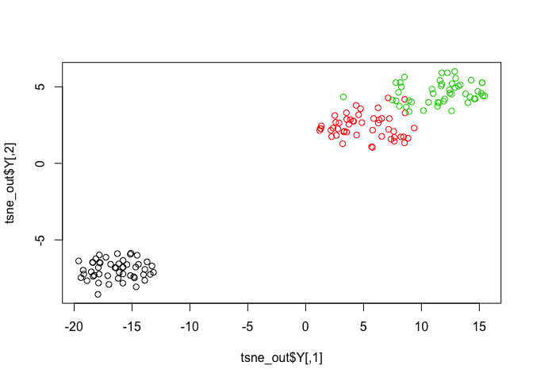
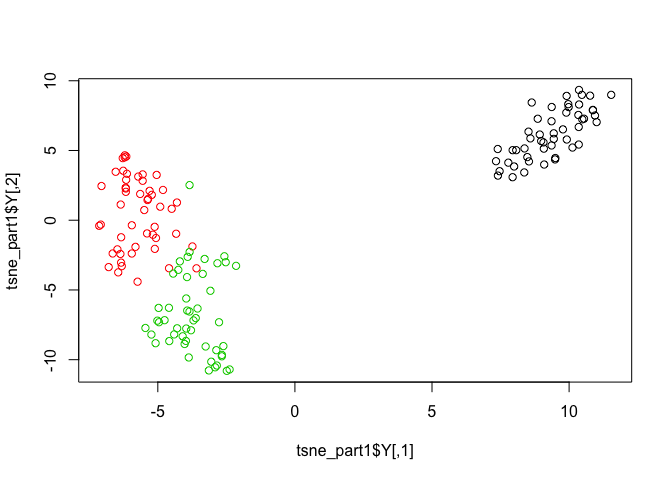
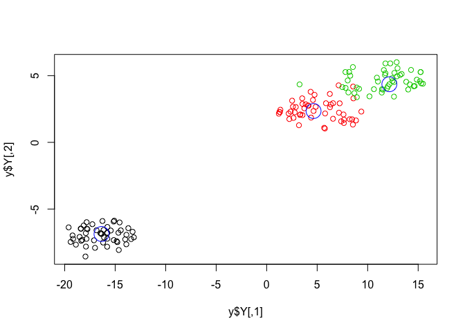

<!-- README.md is generated from README.Rmd. Please edit that file -->


<!-- [](https://cran.r-project.org/package=Rtsne/) -->
<!-- [](https://travis-ci.org/jkrijthe/Rtsne) -->
<!-- [](https://codecov.io/github/jkrijthe/Rtsne?branch=master) -->
<!-- [](https://cran.r-project.org/package=Rtsne/) -->


R wrapper for Van der Maaten's Barnes-Hut implementation of t-Distributed Stochastic Neighbor Embedding
=======================================================================================================

Note
----

This is forked from [Jesse Krijthe](https://github.com/jkrijthe/Rtsne).

Installation
------------

To install the latest version from the github repository, use:

``` {.r}
if(!require(devtools)) install.packages("devtools") # If not already installed
devtools::install_github("wjawaid/Rtsne")
```

Usage
-----

After installing the package, use the following code to run a simple example (to install, see below).

``` {.r}
library(Rtsne) # Load package
iris_unique <- unique(iris) # Remove duplicates
set.seed(42) # Sets seed for reproducibility
tsne_out <- Rtsne(as.matrix(iris_unique[,1:4])) # Run TSNE
plot(tsne_out$Y,col=iris_unique$Species) # Plot the result
```



You can do 350 iterations have a look and then do another 150:

``` {.r}
tsne_part1 <- Rtsne(iris_unique[,1:4], theta = 0.0, pca = FALSE, max_iter = 350)
plot(tsne_part1$Y, col = iris_unique$Species)
```



``` {.r}
tsne_part2 <- Rtsne(iris_unique[,1:4], theta = 0.0, pca = FALSE, max_iter = 150, Y_init=tsne_part1$Y)
plot(tsne_part2$Y, col = iris_unique$Species)
```


You can add new data points to an existing tSNE. For example you can add where the average of each species lies. The filled points show the averages.

``` {.r}
av <- aggregate(iris_matrix, by = list(species=iris_unique$Species), FUN = mean)
x <- rbind(iris_matrix, av[,2:5])
f <- c(rep(TRUE, nrow(iris_matrix)), rep(FALSE, 3))
yin <- rbind(tsne_part2$Y, matrix(rep(0,6), nrow = 3))
y <- Rtsne(x, theta = 0.0, pca = FALSE, Y_init = yin, fix = f)
plot(y$Y, col = c(iris_unique$Species, 3, 1, 2)) # Mix the outline colour
na <- nrow(y$Y)
nn <- na - nrow(av) + 1
points(y$Y[nn:na,], col = 1:3, pch = 20)
```



Details
=======

This R package offers a wrapper around the Barnes-Hut TSNE C++ implementation of [2] [3]. Only minor changes were made to the original code to allow it to function as an R package.

References
==========

[1] L.J.P. van der Maaten and G.E. Hinton. Visualizing High-Dimensional Data Using t-SNE. Journal of Machine Learning Research 9(Nov):2579-2605, 2008.

[2] L.J.P. van der Maaten. Barnes-Hut-SNE. In Proceedings of the International Conference on Learning Representations, 2013.

[3] <http://homepage.tudelft.nl/19j49/t-SNE.html>
